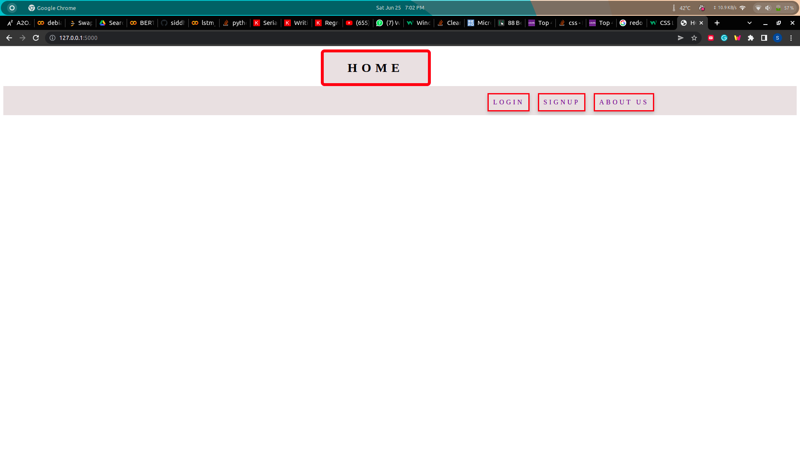
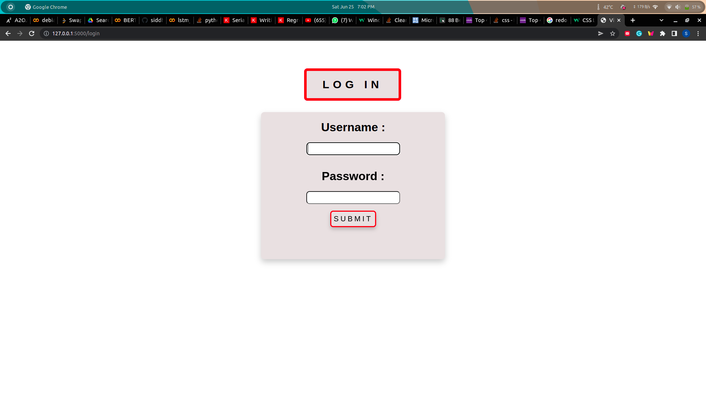
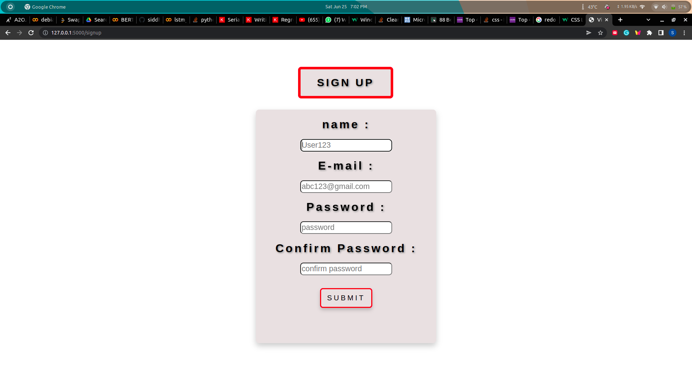
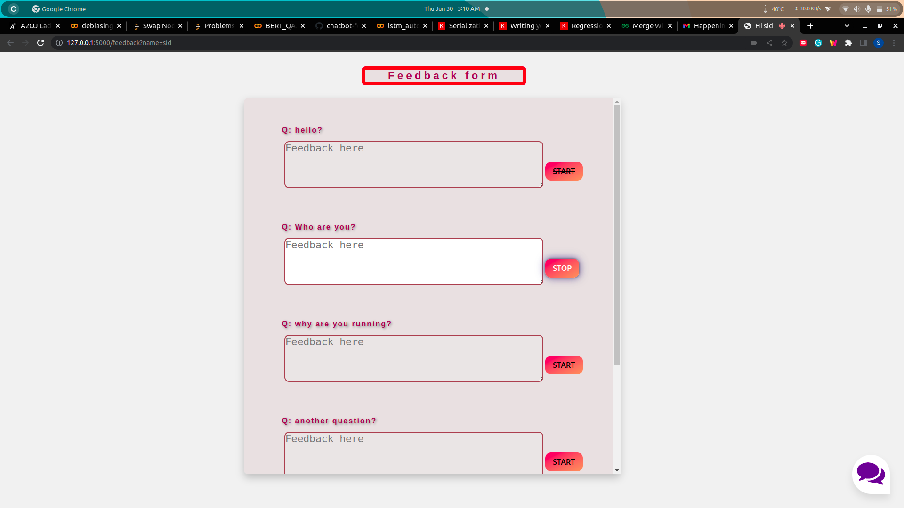
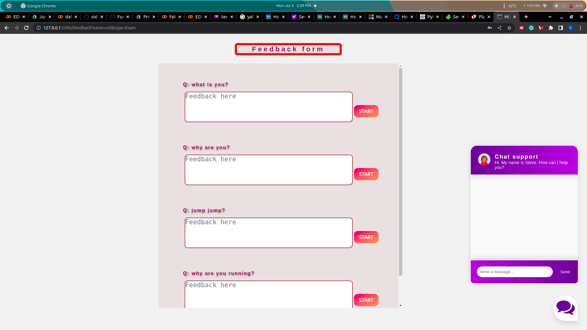
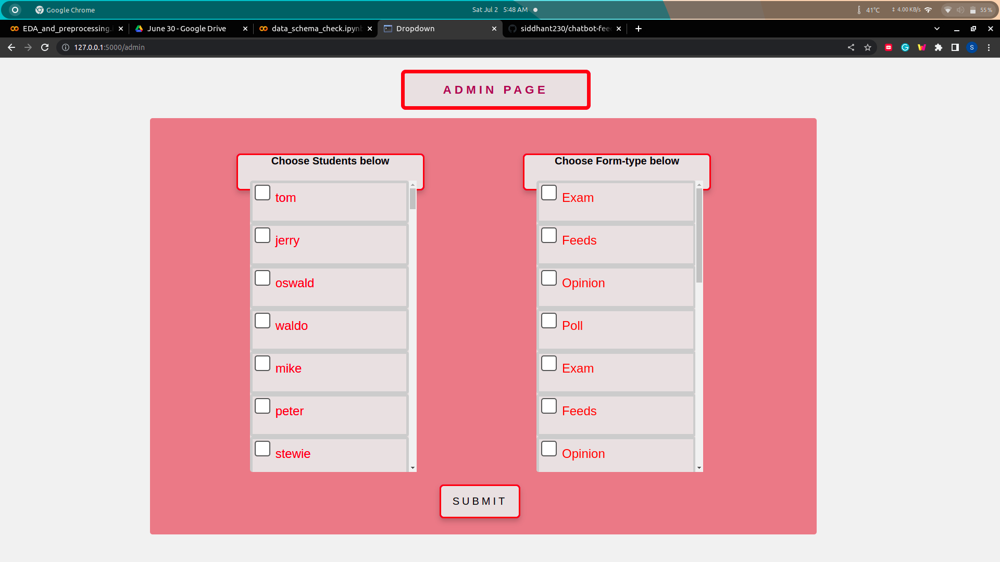

# Chatbot application with speech-assisted Feedback form

## Initial Setup:

For python setup you can visit here: [here](https://realpython.com/installing-python/)

Clone repo and create a virtual environment
```
$ git clone https://github.com/siddhant230/chatbot-feedback-form.git
$ cd chatbot-feedback-form
$ python -m venv venv
$ source venv/Script/activate
```
Install dependencies
```
pip install -r requirements.txt
```

Run
```
python app.py
```
or
```
python3 app.py
```
This will run the app file and serve your flask application on your systems localhost, 
which could be viewed by visiting the link shown in your output console.

Example:
```
Connecting to sqlite database with name: database.db
Connecting established successfully
 * Serving Flask app 'app' (lazy loading)
 * Environment: production
   WARNING: This is a development server. Do not use it in a production deployment.
   Use a production WSGI server instead.
 * Debug mode: on
 * Running on http://127.0.0.1:5000 (Press CTRL+C to quit)          <----- this is the endpoint
 * Restarting with stat
Connecting to sqlite database with name: database.db
Connecting established successfully
 * Debugger is active!
 * Debugger PIN: 115-476-964
```

Page View: 






